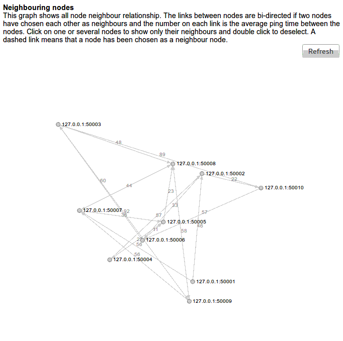

# This is Anond

## 1) Overview

Anond provides transparent IP-level anonymization using virtual
network interfaces, peer-to-peer and overlay network techniques. This
is indeed nothing new in itself and has been researched in projects
such as [*Tarzan*](https://gnunet.org/sites/default/files/tarzan-ccs02.pdf)
(2002) and
[*ANON*](http://www.eecs.harvard.edu/~htk/publication/2002-milcom-kung-bradner-tan.pdf)
(2002). Anond is another take on this but in its heart there is a
variant of an anonymous routing protocol as introduced in the paper
[*Anonymous overlay network supporting authenticated
routing*](Schlegel-Wong-3.pdf) (2010) by Roman Schlegel and Duncan
S. Wong from the Department of Computer Science City University of
Hong Kong.

Anond uses an overlay network of computers (nodes) and a low latency
anonymous routing protocol hides intermediate node hops packets have
to traverse in order to travel from a source to a destination 
node. The routing protocol ensures that each node only knows about the
first hop needed in order reach any other destination node in the overlay
network. To facilitate this each node has an official ipv4-address and
a number of ephemeral overlay ipv6-addresses (in an ipv6 subnet annexed
by Anond).



The animated illustration above is what to expect if the example
mentioned below is started, i.e. a ten node Anond overlay network with
the experimental network topology [d3.js](http://d3js.org) renderer
engine enabled.

The routing protocol provides authentication for routing information
and ensures network topology opaqueness, i.e. routing information is
distributed throughout the nodes and can not be gathered into a
network topology (expect in experimental mode). The authentication
also ensures that malicious nodes can not arbitrarily reduce the path
cost value carried in an anonymous route announcement message for the
purpose of negatively influencing routing efficiency or facilitating
the launch of various attacks such as eavesdropping or
man-in-the-middle attacks.

To make the Anond overlay network transparent to end-user applications
Anond creates a [Virtual Network
Interface](http://en.wikipedia.org/wiki/Virtual_network_interface)
(VIF) and then instructs the operating system to route all IP traffic
this VIF for the Anond ipv6 subnet. This way vanilla desktop
applications and servers can transparently communicate with each other
over an overlay network. This may open up for TCP stack finger
printing but on a grand scope this is an deemed acceptable.

Anond furthermore instructs the operating system to transparently
intercept DNS traffic aimed at `.anond` domains, effectively letting
Anond resolve these mappings, i.e. no DNS leaks.

Anond does not provide [End-to-end
encryption](http://en.wikipedia.org/wiki/End-to-end_encryption) but
counts on application level encryption, e.g. `https` and [bittorent
protocol
encryption](http://en.wikipedia.org/wiki/BitTorrent_protocol_encryption).

The Anond protocol specification and the gory details can be found in
the [Anond APIs and Protocol Messages](doc/specification.md) document.

## 2) Building Anond (Debian/Ubuntu specific)

### 2.1) Pre-requisites

Install Erlang (17B or better):

`$ sudo apt-get install erlang`

Install libsodium (1.0 or better) and make sure to configure it with
`--with-pic` to make enable support for static linking:

```
$ mkdir -p ~/src/libsodium/tags
$ cd ~/src/libsodium/tags
$ svn co https://github.com/jedisct1/libsodium/tags/1.0.0
$ cd 1.0.0
$ configure --with-pic --prefix=/usr/local
...
$ make
...
$ sudo make install
```

### 2.2) Building

Get Anond and build it:

```
$ mkdir -p ~/src/anond
$ cd ~/src/anond
$ svn co https://github.com/joagre/anond/trunk
...
$ make
```

Anond is now ready to be run from the code repository itself,
i.e. without the need to build a release package.

### 1.3) Building a release package (optional)

Anond is typically shipped as a self-contained release package bundled
with a stream-lined Erlang run-time system:

```
$ cd ~/src/anond
$ make release
...
$ ls -l build/*.tgz
-rw-rw-r-- 1 jocke jocke 6170369 nov  9 11:33 build/anond-0.2.tgz
```

Send it to your best friend (or worst).

## 3) Starting Anond

The behaviour of Anond is governed by a json based configuration file
which is read by the Anond on startup.

The Anond start script has the following options:

```
$ bin/anond -h
Usage:
bin/anond [-c CONFIG-FILENAME] [-i]
    Start anond
bin/anond -s [-a IP-ADDRESS] [-p PORT]
    Stop anond
bin/anond -r [-a IP-ADDRESS] [-p PORT]
    Reread the anond config file
bin/anond -k <SELF-SIGNED CERTIFICATE FILE>
    Generate a self-signed SSL certificate
bin/anond -j <PUBLIC KEY FILE> <SECRET KEY FILE>
    Generate a public/secret key pair used for signing
bin/anond -l <SECRET KEY FILE> <DATA FILE>
    Sign data using a secret signing key
bin/anond -h
    This help text
```

[etc/anond.conf](etc/anond.conf) is an example of a configuration
file:

```json
{
    "mode": "normal",
    "nodes": [
        {
            "node-address": "0.0.0.0:50000",
            "logging": true,
            "experimental-api": true,
            "db": {
                "directory": "./",
                "clear-on-start": true
            },
            "directory-server": "127.0.0.1:6700",
            "create-tun-device": false,
            "overlay-addresses": ["fe80::c685:8ff:fe46:a"],
            "public-key": "${CONFIG_DIR}/public-signing.key",
            "secret-key": "${CONFIG_DIR}/secret-signing.key",
            "number-of-neighbours": 2,
            "refresh-neighbours-interval": 1800,
            "recalc-interval": 30,
            "auto-recalc": true,
            "max-cell-size": 977,
            "cell-sending-timeout": 500,
            "path-cost": {
                "number-of-echo-requests": 16,
                "acceptable-number-of-echo-replies": 8,
                "delay-between-echo-requests": 1000,
                "delay-between-measurements": 5000,
                "echo-reply-timeout": 2
            }
        }
    ],
    "anond-control": {
        "listen": "127.0.0.1:23313"
    },
    "logs": {
        "daemon": {
            "enabled": true,
            "filter": {
                "show": ["*"],
                "hide": []
            },
            "tty": false,
            "file": {
                "enabled": true,
                "path": "./daemon.log"
            }
        },
        "dbg": {
            "enabled": true,
            "filter": {
                "show": ["*"],
                "hide": []
            },
            "tty": false,
            "file": {
                "enabled": true,
                "path": "./dbg.log"
            }
        },
        "error": {
            "enabled": true,
            "tty": true,
            "file": {
                "enabled": true,
                "path": "./error.log"
            }
        }
    }
}
```

The content of a configuration file is at the moment undocumented but
most configurables are self-explanatory. Looking at the *internal*
configuration file schema in
[lib/common/src/common_config_json_serv.erl](lib/common/src/common_config_json_serv.erl)
can be helpful if in need.

A configuration file can be written to instruct anond to start
several anond nodes. This comes handy during development of
anond.conf and for demo/simulation purposes.

To start a small simulation with ten nodes and a directory server a
configuration file such as
[anond-small-simulation.conf](lib/test/etc/anond-small-simulation.conf)
could be used. It realises the small simulation as written on the back
of this envelope:


The path costs are written in red ink and the node neighbour
relationships in blue. In this simulation each node has two
neighbours.

To start the simulation run:

`$ bin/anond -i -c lib/test/etc/anond-small-simulation.conf`

Anond writes log entries to three log files, i.e.

* `/tmp/daemon.log` - events during normal operation
* `/tmp/error.log` - unexpected errors (there are no expected errors :-)
* `/tmp/dbg.log` - debug information

The characteristics of these log files are specified in the
configuration file, e.g. file paths and log filtering.

As an experimental feature the routing information in each node can be
extracted by the directory server and merged into a network
topology. This network topology can then be used by the Anond renderer
engine, based in the [d3.js](http://d3js.org) library, to visualise
the topology of the overlay network.

To inspect the topology of the small simulation wait point a browser
to [https://127.0.0.1:6700/index.html](https://127.0.0.1:6700/index.html)
in order to monitor the state of the overlay network.

## 4) Implemtation details

The Anond Erlang code base can be easily analysed for type anomalies:

```
$ make dialyzer
...
```

Anond is written using the [Erlang](http://www.erlang.org) programming
language and uses its strengths when it comes to building large scale
network daemons. It also relies on the Erlang OTP principles to
achieve fault tolerance.

The only Erlang programming pattern **not** used is the
[gen_server
behaviour](http://www.erlang.org/doc/design_principles/gen_server_concepts.html)
It hides Erlang's message passing mechanism and turns concurrent
programming into a boring slush of callback functions. It must be fun
to compute. So say Mundungus.

A number of Erlang [coding templates](coding_templates) have been used
to normalise the look and feel of the different types of Erlang modules
constituting the Anond code base.
